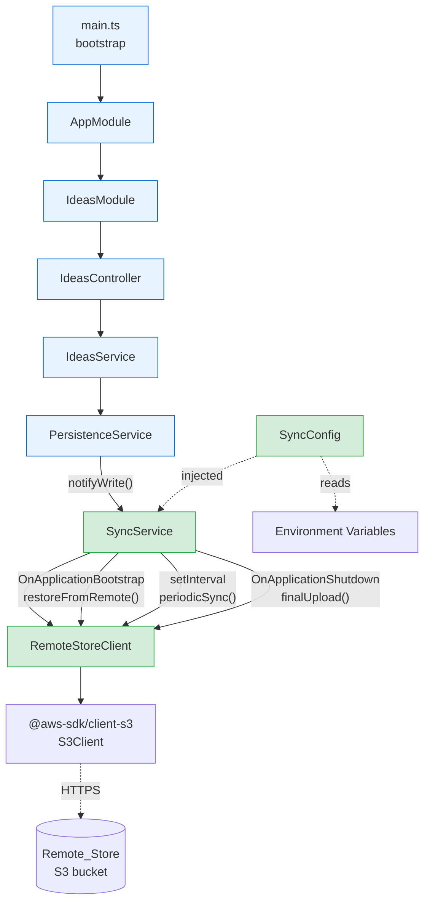
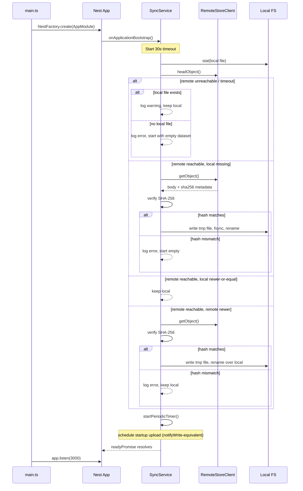
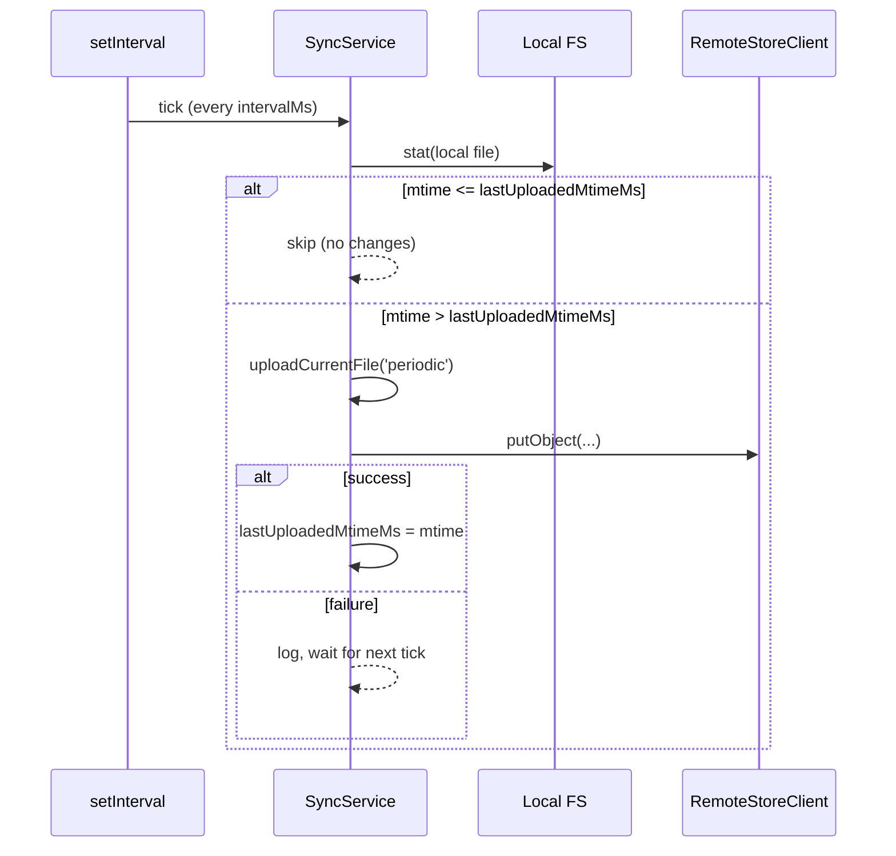

# Design Document

## Overview

This feature adds a cloud synchronization layer on top of the existing file-based `PersistenceService` so the dating-calendar application can survive ephemeral filesystems (containers, transient hosts) without changing its programming model. The design preserves the simple "JSON file on disk" approach as the source of truth at runtime and treats the Remote_Store (S3-compatible bucket) as a durable backup that is restored on startup and updated after every write.

The implementation centers on a new `SyncService` that:

- Restores `data/ideas.json` from the Remote_Store on application startup, before HTTP traffic is accepted.
- Uploads the local file to the Remote_Store after every successful `writeData()` call, debounced and cancellable so only the latest state ever lands remotely.
- Runs a periodic background sync (default 60s) as a safety net for missed uploads.
- Performs a final synchronous upload on shutdown.
- Verifies integrity end-to-end with SHA-256, stored in S3 user metadata.
- Falls back gracefully to local-only operation when the bucket is not configured or the Remote_Store is unreachable.

`PersistenceService`'s public API (`readData()`, `writeData(data)`) is unchanged. It gains an optional dependency on `SyncService` and notifies it after a successful write. All sync work is best-effort from `PersistenceService`'s perspective: sync errors never propagate into HTTP request handling.

### Design Principles

- **Local-first**: the local file is always the source of truth at runtime. Sync is a backup channel.
- **Non-blocking writes**: `writeData()` returns as soon as the local write succeeds. Upload runs after.
- **Cancellable in-flight work**: a newer write always wins; older uploads are aborted.
- **Atomic at both ends**: temp-file-and-rename for local writes, single-PUT (atomic by S3 contract) for remote writes.
- **Lightweight dependencies**: `@aws-sdk/client-s3` is the only new runtime dependency. Periodic scheduling uses plain `setInterval` rather than pulling in `@nestjs/schedule`.

### Research Notes

- **AWS SDK v3 `@aws-sdk/client-s3`**: modular package, ~1.5MB, supports custom endpoints (S3-compatible stores like MinIO, R2, DigitalOcean Spaces) via the `endpoint` option. `PutObjectCommand` is atomic from the consumer's perspective: an S3 PUT either fully succeeds and replaces the object or fails and leaves the prior version in place. Custom metadata is set via the `Metadata` field and surfaces as `x-amz-meta-<key>` HTTP headers; on `GetObjectCommand` responses it is exposed as `Metadata`.
- **AbortController support**: every AWS SDK v3 command accepts `{ abortSignal }` in its second argument, which lets us cancel an in-flight upload when a newer write arrives.
- **NestJS lifecycle hooks**: `OnApplicationBootstrap` runs after every module is initialized but before `app.listen()` in `main.ts` returns. This is the correct hook for `Startup_Restore` because it lets us block HTTP readiness on a successful restore (or its timeout). `OnApplicationShutdown` (combined with `app.enableShutdownHooks()`) provides the deterministic shutdown hook needed for the final upload.
- **Atomic local writes**: the standard pattern is `fs.writeFile(tmp, data); fs.rename(tmp, target)`. `rename` is atomic on POSIX filesystems within the same directory, so a reader either sees the old file or the new file, never a partial one.

## Architecture

The feature introduces one new service (`SyncService`), one new configuration provider (`SyncConfig`), and one thin S3 client wrapper (`RemoteStoreClient`). Everything lives under `src/ideas/persistence/sync/`. `PersistenceService` is updated to optionally inject `SyncService` and notify it after writes.

### Component Diagram



### Module Wiring

`SyncService`, `SyncConfig`, and `RemoteStoreClient` are registered as providers in `IdeasModule` alongside `PersistenceService`. `SyncService` is exported from the module only if other features need it later; for now it is internal.

```typescript
// src/ideas/ideas.module.ts (after change)
@Module({
  controllers: [IdeasController],
  providers: [
    IdeasService,
    PersistenceService,
    SyncService,
    RemoteStoreClient,
    { provide: SYNC_CONFIG_TOKEN, useFactory: loadSyncConfig },
  ],
  exports: [IdeasService],
})
export class IdeasModule {}
```

`PersistenceService` declares `SyncService` as an `@Optional()` dependency so existing tests that construct it directly (e.g. `new PersistenceService(dataDir)`) keep working.

```typescript
constructor(
  @Optional() @Inject(DATA_DIR_TOKEN) dataDir?: string,
  @Optional() private readonly syncService?: SyncService,
) { ... }
```

### Bootstrap Sequence

`main.ts` is updated to enable shutdown hooks and to wait for `SyncService.waitUntilReady()` before calling `app.listen()`. The `OnApplicationBootstrap` hook does most of the work; `waitUntilReady()` is a fence that makes the contract explicit.

```typescript
// src/main.ts (after change)
const app = await NestFactory.create(AppModule);
app.enableShutdownHooks();
app.useGlobalPipes(new ValidationPipe({ ... }));
await app.get(SyncService).waitUntilReady(); // resolves after startup restore completes or times out
await app.listen(3000);
```

## Components and Interfaces

### `SyncConfig`

Plain immutable object loaded once at module init from `process.env`. Implemented as a factory provider so tests can override it cleanly.

```typescript
export const SYNC_CONFIG_TOKEN = 'SYNC_CONFIG';

export interface SyncConfig {
  enabled: boolean;          // false when SYNC_BUCKET_NAME is missing or empty
  bucketName: string;        // SYNC_BUCKET_NAME
  region: string;            // SYNC_REGION, default 'us-east-1'
  keyPrefix: string;         // SYNC_KEY_PREFIX, default 'data/'
  intervalMs: number;        // SYNC_INTERVAL_MS, clamped to [5000, 3600000], default 60000
  endpoint?: string;         // SYNC_ENDPOINT (optional, for S3-compatible stores)
  startupTimeoutMs: number;  // 30000 (per Requirement 1)
  shutdownTimeoutMs: number; // 10000 (per Requirement 3.3)
  uploadDebounceMs: number;  // 250 (groups bursts of writes into one upload, well under the 5s budget)
  maxRetries: number;        // 3 (per Requirement 2.2)
  initialBackoffMs: number;  // 1000 (per Requirement 2.2)
}

export function loadSyncConfig(): SyncConfig { ... }
```

The remote object key is derived as `${keyPrefix}ideas.json` (e.g. `data/ideas.json`). Trailing slash on the prefix is normalized.

### `RemoteStoreClient`

Thin wrapper around `S3Client` that exposes only the operations `SyncService` needs. Decoupling the SDK behind this seam keeps `SyncService` test-friendly and makes the S3 surface area obvious.

```typescript
export interface RemoteObject {
  body: Buffer;
  sha256?: string;       // from x-amz-meta-sha256
  lastModified?: Date;   // from S3 LastModified
}

@Injectable()
export class RemoteStoreClient {
  constructor(@Inject(SYNC_CONFIG_TOKEN) private readonly config: SyncConfig) { ... }

  async putObject(
    body: Buffer,
    sha256: string,
    signal?: AbortSignal,
  ): Promise<void>;

  async getObject(signal?: AbortSignal): Promise<RemoteObject | null>; // null on 404

  async headObject(signal?: AbortSignal): Promise<{ lastModified?: Date; sha256?: string } | null>;
}
```

The wrapper instantiates `S3Client` lazily on first use using `region`, optional `endpoint`, and the standard AWS credential provider chain (env vars, shared config, IMDS). Authentication is intentionally delegated to the SDK's default chain to keep the design small.

### `SyncService`

The orchestrator. Owns the in-flight upload, the debounce timer, the periodic timer, and the readiness signal.

```typescript
@Injectable()
export class SyncService
  implements OnApplicationBootstrap, OnApplicationShutdown
{
  // Lifecycle
  async onApplicationBootstrap(): Promise<void>;
  async onApplicationShutdown(signal?: string): Promise<void>;

  // Public API
  waitUntilReady(): Promise<void>;
  notifyWrite(): void; // called by PersistenceService after successful local write

  // Internal
  private async restoreFromRemote(): Promise<void>;
  private async uploadCurrentFile(
    reason: 'write' | 'periodic' | 'startup' | 'shutdown',
  ): Promise<void>;
  private startPeriodicTimer(): void;
  private stopPeriodicTimer(): void;
}
```

Internal state (private fields):

| Field                                         | Purpose                                                                                                                                  |
| --------------------------------------------- | ---------------------------------------------------------------------------------------------------------------------------------------- |
| `readyPromise: Promise<void>`                 | Resolved when `restoreFromRemote()` finishes or its 30s budget expires.                                                                  |
| `currentUploadAbort: AbortController \| null` | Tracks the in-flight upload so a newer write can cancel it.                                                                              |
| `pendingUploadTimer: NodeJS.Timeout \| null`  | Debounce timer for `notifyWrite()`.                                                                                                      |
| `periodicTimer: NodeJS.Timeout \| null`       | Background interval timer.                                                                                                               |
| `lastUploadedMtimeMs: number \| null`         | Mtime of the file at the time of the last successful upload; used to skip no-op periodic uploads.                                        |
| `lastWriteSeq: number`                        | Monotonic counter incremented on every `notifyWrite()`; the value seen by an upload at start tells it whether a newer write has arrived. |

### Updated `PersistenceService`

Two surgical changes only:

1. `writeData()` performs the local write atomically (temp + rename) instead of `fs.writeFile` directly.
2. After a successful write, it calls `this.syncService?.notifyWrite()` (fire-and-forget, no await).

```typescript
async writeData(data: StoredData): Promise<void> {
  try {
    await this.ensureDataDirectory();
    const tmpPath = `${this.filePath}.tmp-${process.pid}-${Date.now()}`;
    await fs.writeFile(tmpPath, JSON.stringify(data, null, 2), 'utf-8');
    await fs.rename(tmpPath, this.filePath);
  } catch (error) {
    throw new InternalServerErrorException('Storage failure: unable to read/write data');
  }
  // Best-effort: never throw out of writeData() because of sync.
  this.syncService?.notifyWrite();
}
```

The public signature is unchanged; the optional `SyncService` injection means existing direct constructions in tests continue to work and never touch the network.

## Data Flow

### Startup Restore



The post-restore startup upload (Requirement 2.6) is implemented by calling `notifyWrite()` once after a successful restore (or after deciding to keep the local file). This funnels the startup case through the same debounced upload path as runtime writes, keeping the code simple.

### Write-Triggered Upload (with debounce and cancellation)

```mermaid
sequenceDiagram
    participant Caller as IdeasService
    participant Persist as PersistenceService
    participant FS as Local FS
    participant Sync as SyncService
    participant Remote as RemoteStoreClient

    Caller->>Persist: writeData(data)
    Persist->>FS: writeFile(tmp); rename(tmp, target)
    Persist-->>Caller: resolve()
    Persist->>Sync: notifyWrite()
    Note over Sync: lastWriteSeq++; reset 250ms debounce
    Sync->>Sync: pendingUploadTimer fires

    alt currentUploadAbort != null
        Sync->>Remote: abort in-flight upload
    end

    Sync->>FS: read file + stat
    Sync->>Sync: compute SHA-256
    Sync->>Remote: putObject(body, sha256, abortSignal)
    Note over Remote: with up to 3 retries (1s, 2s, 4s)
    Remote-->>Sync: success
    Sync->>Sync: lastUploadedMtimeMs = mtime
```

Bursty writes (e.g. multiple ideas added in quick succession) collapse into one upload because each `notifyWrite()` resets the 250ms debounce timer.

### Periodic Background Sync



### Shutdown

```mermaid
sequenceDiagram
    participant OS as SIGTERM/SIGINT
    participant App as Nest App
    participant Sync as SyncService
    participant Remote as RemoteStoreClient

    OS->>App: signal
    App->>Sync: onApplicationShutdown()
    Sync->>Sync: stopPeriodicTimer(); cancel debounce timer
    alt currentUploadAbort != null
        Sync->>Remote: abort in-flight upload
        Sync->>Sync: await prior upload settle
    end
    Sync->>Sync: uploadCurrentFile('shutdown') with 10s timeout
    alt upload completes
        Sync-->>App: resolve
    else timeout or failure
        Sync-->>Sync: log error
        Sync-->>App: resolve (do not block exit)
    end
    App->>OS: process exits
```

## Components and Interfaces

(Listed above under Architecture; collected here as the canonical interface summary.)

| Component            | Responsibility                                                                   | Lifetime  |
| -------------------- | -------------------------------------------------------------------------------- | --------- |
| `PersistenceService` | Local read/write of `data/ideas.json`, atomic writes, notify sync.               | Singleton |
| `SyncService`        | Orchestrates startup restore, debounced uploads, periodic sync, shutdown upload. | Singleton |
| `RemoteStoreClient`  | Thin S3 facade: `putObject`, `getObject`, `headObject` with abort support.       | Singleton |
| `SyncConfig` (token) | Immutable resolved configuration loaded from env.                                | Singleton |

## Data Models

### `StoredData` (existing, unchanged)

```typescript
interface StoredData {
  ideas: Idea[];
}
```

### `RemoteObject` (new)

```typescript
interface RemoteObject {
  body: Buffer; // raw JSON bytes as stored remotely
  sha256?: string; // hex digest from x-amz-meta-sha256, if present
  lastModified?: Date; // S3 LastModified
}
```

### Remote Storage Layout

| Aspect        | Value                                                   |
| ------------- | ------------------------------------------------------- |
| Bucket        | `${SYNC_BUCKET_NAME}`                                   |
| Object key    | `${SYNC_KEY_PREFIX}ideas.json` (e.g. `data/ideas.json`) |
| Content-Type  | `application/json`                                      |
| User metadata | `x-amz-meta-sha256: <hex digest of body>`               |

A single object key is used. There is no per-version history at the application level; if S3 versioning is enabled on the bucket, the SDK's PUT will create a new version, but that is outside the application's concern.

### `SyncConfig` (new)

See the interface definition under "Components and Interfaces".

## Correctness Properties

These properties define the formal correctness guarantees the implementation must uphold. They are expressed as invariants suitable for property-based testing with `fast-check`.

### Property 1: Local Write Roundtrip

**Validates: Requirements 5.1**

**For all** valid `StoredData` values `d`:
`writeData(d)` followed by `readData()` **shall** return data structurally equal to `d`.

This property ensures the atomic temp-file-rename strategy does not lose or corrupt data locally.

### Property 2: Upload Integrity

**Validates: Requirements 6.1**

**For all** byte sequences `b` written to the local file:
When `SyncService` uploads `b`, the SHA-256 hash included in S3 metadata **shall** equal `SHA-256(b)`.

This guarantees that a download followed by hash verification will accept the data if no corruption occurred in transit.

### Property 3: Download Integrity Rejection

**Validates: Requirements 6.2, 6.3, 6.4**

**For all** payloads `p` and metadata hashes `h` where `SHA-256(p) ≠ h`:
`SyncService` **shall not** write `p` to the local file system.

This ensures corrupted downloads are never promoted to the local data path.

### Property 4: Debounce Coalescence

**Validates: Requirements 2.4**

**For all** sequences of `n` rapid `notifyWrite()` calls arriving within the debounce window (250ms):
Exactly **one** upload attempt **shall** be initiated, containing the file state at the time the debounce timer fires.

This verifies that bursty writes collapse correctly and do not produce redundant network calls.

### Property 5: Cancellation Safety

**Validates: Requirements 2.4, 2.5**

**For all** sequences where `notifyWrite()` is called while an upload is in-flight:
The in-flight upload **shall** be aborted, and a new upload of the latest file state **shall** be initiated after the debounce window. The Remote_Store **shall** never reflect an intermediate state that was superseded before the upload completed.

### Property 6: Graceful Degradation

**Validates: Requirements 4.5, 5.3**

**For all** configurations where `SYNC_BUCKET_NAME` is unset or empty:
`writeData()` and `readData()` **shall** behave identically to the baseline implementation (no network calls, no additional latency beyond 10ms, no thrown errors from sync).

### Property 7: Startup Restore Freshness

**Validates: Requirements 1.1, 1.2**

**For all** states where the Remote_Store contains an object with `lastModified > local file mtime`:
After `onApplicationBootstrap()` completes, the local file **shall** contain the content from the Remote_Store (assuming integrity check passes).

### Property 8: Periodic Sync No-Op Idempotence

**Validates: Requirements 3.2**

**For all** states where the local file's mtime has not changed since the last successful upload:
The periodic timer tick **shall not** invoke `putObject()`.

This ensures the periodic timer does not generate unnecessary network traffic.

## File Structure

```
src/ideas/persistence/
├── persistence.service.ts          (existing, modified)
├── persistence.service.spec.ts     (existing, updated)
└── sync/
    ├── sync.service.ts             (new)
    ├── sync.service.spec.ts        (new)
    ├── sync-config.ts              (new)
    ├── remote-store-client.ts      (new)
    └── remote-store-client.spec.ts (new)

test/property/
├── sync-integrity.property.spec.ts         (new)
└── sync-debounce.property.spec.ts          (new)
```

## Dependencies

| Package              | Version    | Purpose                                      |
| -------------------- | ---------- | -------------------------------------------- |
| `@aws-sdk/client-s3` | `^3.600.0` | S3 PutObject, GetObject, HeadObject commands |

No other new runtime dependencies. Dev dependencies (`fast-check`, `@nestjs/testing`, `jest`) are already present.

## Error Handling

| Scenario                       | Behavior                                                              |
| ------------------------------ | --------------------------------------------------------------------- |
| Remote unreachable on startup  | Log warning/error; fall back to local file or empty dataset           |
| Upload fails (write-triggered) | Retry 3× with 1s/2s/4s backoff; log error; do not block `writeData()` |
| Upload fails (periodic)        | Log; retry on next interval                                           |
| Upload fails (shutdown)        | Log error; exit anyway after 10s timeout                              |
| Integrity mismatch on download | Discard download; keep local file or use empty dataset                |
| Invalid `SYNC_INTERVAL_MS` env | Fall back to 60000ms default; log warning                             |
| Missing `SYNC_BUCKET_NAME`     | Disable sync entirely; local-only mode                                |

## Testing Strategy

### Unit Tests

- **`SyncService`**: Mock `RemoteStoreClient` to verify startup restore logic (all branches), debounce/cancel behavior, periodic timer skip logic, shutdown upload, and graceful fallback when disabled.
- **`RemoteStoreClient`**: Mock `S3Client.send()` to verify correct command construction, metadata handling, and abort signal forwarding.
- **`PersistenceService`** (updated): Verify atomic write (temp + rename), verify `notifyWrite()` is called after successful writes, verify sync errors do not propagate.
- **`loadSyncConfig()`**: Test env-var parsing, defaults, clamping of invalid intervals, and disabled state.

### Property-Based Tests (fast-check)

- `sync-integrity.property.spec.ts`: Generates arbitrary `StoredData`, writes, uploads, and verifies SHA-256 roundtrip (Properties 1, 2, 3).
- `sync-debounce.property.spec.ts`: Generates arbitrary sequences of `notifyWrite()` calls with varying timing and verifies coalescence and cancellation invariants (Properties 4, 5).

### Integration / E2E Tests

- Extend existing `ideas-api.e2e-spec.ts` to verify that with `SYNC_BUCKET_NAME` unset, the API behaves identically to before (Property 6).
- Optional: add a test using a local MinIO container (or S3 mock) to verify full restore-write-upload-shutdown cycle.
