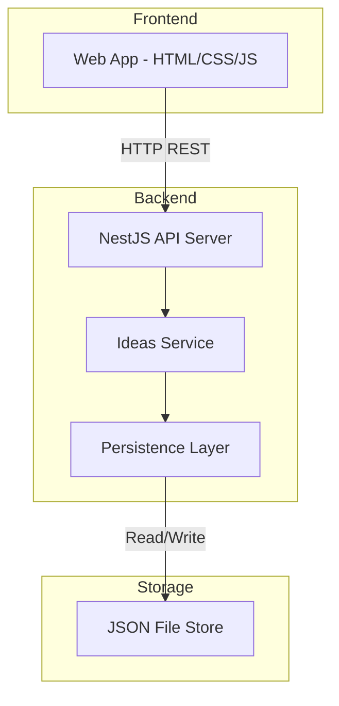

# Design Document: Ukrainian Alphabet Date Dashboard

## Overview

The Ukrainian Alphabet Date Dashboard is a full-stack web application that helps couples plan creative dates organized by the 33 letters of the Ukrainian alphabet. The system follows a client-server architecture with a NestJS backend API and a responsive web frontend.

The frontend renders a Google Calendar-inspired grid of 33 cells (one per letter), each supporting CRUD operations on "ideas" — date suggestions that start with the corresponding letter. The backend exposes a RESTful API for persisting and managing ideas in a durable data store.

Key design goals:

- Simple, responsive grid UI with inline editing
- RESTful API with proper validation and error handling
- Durable file-based persistence (no external database dependency)
- Clean separation between frontend and backend concerns

## Architecture

The system uses a two-tier architecture:



### Frontend Architecture

The frontend is a single-page web application that communicates with the backend via fetch/HTTP. It renders a responsive CSS Grid of 33 cells. Each cell manages its own local state for inline idea management (add, remove, mark as done).

### Backend Architecture

The NestJS backend follows the standard module pattern:

- **Controller Layer**: Handles HTTP routing, request validation, and response formatting
- **Service Layer**: Business logic for idea management (CRUD operations, validation)
- **Persistence Layer**: File-based JSON storage with read/write operations

### Communication

- Protocol: HTTP/REST
- Format: JSON request/response bodies
- Error responses follow a consistent `{ statusCode, message, error }` shape

## Components and Interfaces

### Backend Components

#### IdeasController

Handles HTTP routing for all idea-related endpoints.

```typescript
@Controller('api/ideas')
class IdeasController {
  // GET /api/ideas - Retrieve all letters with their ideas
  @Get()
  getAllLettersWithIdeas(): Promise<LetterWithIdeas[]>

  // POST /api/ideas/:letter - Create a new idea for a letter
  @Post(':letter')
  createIdea(@Param('letter') letter: string, @Body() dto: CreateIdeaDto): Promise<Idea>

  // DELETE /api/ideas/:id - Delete an idea by ID
  @Delete(':id')
  deleteIdea(@Param('id') id: string): Promise<{ deleted: true }>

  // PATCH /api/ideas/:id/status - Update idea completion status
  @Patch(':id/status')
  updateIdeaStatus(@Param('id') id: string, @Body() dto: UpdateIdeaStatusDto): Promise<Idea>
}
```

#### IdeasService

Business logic layer for managing ideas.

```typescript
@Injectable()
class IdeasService {
  getAllLettersWithIdeas(): Promise<LetterWithIdeas[]>;
  createIdea(letter: string, text: string): Promise<Idea>;
  deleteIdea(id: string): Promise<void>;
  updateIdeaStatus(id: string, done: boolean): Promise<Idea>;
}
```

#### PersistenceService

Handles reading/writing data to/from the JSON file store.

```typescript
@Injectable()
class PersistenceService {
  readData(): Promise<StoredData>;
  writeData(data: StoredData): Promise<void>;
}
```

### Frontend Components

#### DashboardGrid

The main container component that renders the 33-cell grid layout. Responsible for fetching data on load and distributing it to cells.

#### LetterCell

An individual cell representing one Ukrainian letter. Manages:

- Display of letter label
- Idea list rendering
- Add idea form (show/hide input field)
- Remove and mark-as-done controls per idea

#### API Client Module

A thin wrapper around `fetch` that handles:

- Base URL configuration
- JSON serialization/deserialization
- Error response handling

### API Endpoints

| Method | Path                  | Description                | Request Body        | Response            |
| ------ | --------------------- | -------------------------- | ------------------- | ------------------- |
| GET    | /api/ideas            | Get all letters with ideas | —                   | `LetterWithIdeas[]` |
| POST   | /api/ideas/:letter    | Create idea for a letter   | `{ text: string }`  | `Idea`              |
| DELETE | /api/ideas/:id        | Delete an idea             | —                   | `{ deleted: true }` |
| PATCH  | /api/ideas/:id/status | Update completion status   | `{ done: boolean }` | `Idea`              |

### DTOs and Validation

```typescript
class CreateIdeaDto {
  @IsNotEmpty()
  @MaxLength(200)
  text: string;
}

class UpdateIdeaStatusDto {
  @IsBoolean()
  done: boolean;
}
```

## Data Models

### Idea

```typescript
interface Idea {
  id: string; // UUID v4
  letter: string; // One of 33 Ukrainian alphabet letters
  text: string; // Idea description (1-200 chars, trimmed)
  done: boolean; // Completion status
  createdAt: string; // ISO 8601 timestamp
}
```

### LetterWithIdeas

```typescript
interface LetterWithIdeas {
  letter: string; // Ukrainian alphabet letter
  ideas: Idea[]; // Ideas sorted by createdAt ascending
}
```

### StoredData (Persistence)

```typescript
interface StoredData {
  ideas: Idea[]; // Flat array of all ideas
}
```

The data is stored as a single JSON file (`data/ideas.json`) containing all ideas. On read, ideas are grouped by letter and sorted by creation timestamp. This approach is simple and sufficient for the expected data volume (33 letters × a handful of ideas each).

### Ukrainian Alphabet Constant

```typescript
const UKRAINIAN_ALPHABET: string[] = [
  'А',
  'Б',
  'В',
  'Г',
  'Ґ',
  'Д',
  'Е',
  'Є',
  'Ж',
  'З',
  'И',
  'І',
  'Ї',
  'Й',
  'К',
  'Л',
  'М',
  'Н',
  'О',
  'П',
  'Р',
  'С',
  'Т',
  'У',
  'Ф',
  'Х',
  'Ц',
  'Ч',
  'Ш',
  'Щ',
  'Ь',
  'Ю',
  'Я',
];
```

This constant is used for:

- Validating incoming letter parameters
- Generating the full grid response (ensuring all 33 letters are always returned, even those with no ideas)

## Correctness Properties

_A property is a characteristic or behavior that should hold true across all valid executions of a system — essentially, a formal statement about what the system should do. Properties serve as the bridge between human-readable specifications and machine-verifiable correctness guarantees._

### Property 1: API always returns exactly 33 letters with ideas sorted by creation time

_For any_ set of stored ideas (including an empty set), calling `getAllLettersWithIdeas` SHALL return exactly 33 entries — one for each Ukrainian alphabet letter — and the ideas within each letter SHALL be sorted by `createdAt` in ascending order.

**Validates: Requirements 1.4, 3.3, 6.1**

### Property 2: Idea creation round-trip preserves data

_For any_ valid Ukrainian letter and any valid idea text (1-200 non-whitespace-only characters), creating an idea SHALL return an object containing a unique `id`, the same `letter`, the same `text` (trimmed), `done` set to `false`, and a valid ISO 8601 `createdAt` timestamp; and subsequently retrieving ideas for that letter SHALL include the created idea with all fields preserved.

**Validates: Requirements 2.3, 6.2, 7.3**

### Property 3: Invalid text is rejected

_For any_ string that is empty, composed entirely of whitespace characters, or exceeds 200 characters in length, attempting to create an idea SHALL be rejected with a validation error and the set of stored ideas SHALL remain unchanged.

**Validates: Requirements 2.5, 2.6, 6.7**

### Property 4: Invalid letter is rejected

_For any_ string that is not one of the 33 Ukrainian alphabet letters, attempting to create an idea with that letter SHALL return a 400 Bad Request error and no idea SHALL be persisted.

**Validates: Requirements 6.5**

### Property 5: Delete removes idea from store

_For any_ idea that has been successfully created, deleting that idea by its ID SHALL result in the idea no longer appearing in any subsequent retrieval of ideas for its letter.

**Validates: Requirements 4.3, 6.8**

### Property 6: Status update sets completion state

_For any_ existing idea and any boolean value (true or false), updating the idea's status with that value SHALL result in the idea's `done` field equaling the provided value in both the response and subsequent retrievals.

**Validates: Requirements 5.2, 6.4**

### Property 7: Persistence round-trip

_For any_ set of ideas created through the API, writing to the data store and then reading back (simulating a server restart) SHALL return the same set of ideas with identical `id`, `letter`, `text`, `done`, and `createdAt` values.

**Validates: Requirements 7.1, 7.2**

## Error Handling

### Backend Error Handling

| Scenario                    | HTTP Status | Response Body                                                                                                            |
| --------------------------- | ----------- | ------------------------------------------------------------------------------------------------------------------------ |
| Invalid letter parameter    | 400         | `{ statusCode: 400, message: "Invalid letter: must be one of the 33 Ukrainian alphabet letters", error: "Bad Request" }` |
| Empty/whitespace idea text  | 400         | `{ statusCode: 400, message: "Idea text must not be empty or whitespace-only", error: "Bad Request" }`                   |
| Idea text exceeds 200 chars | 400         | `{ statusCode: 400, message: "Idea text must not exceed 200 characters", error: "Bad Request" }`                         |
| Idea not found              | 404         | `{ statusCode: 404, message: "Idea not found", error: "Not Found" }`                                                     |
| Data store unavailable      | 500         | `{ statusCode: 500, message: "Storage failure: unable to read/write data", error: "Internal Server Error" }`             |

### Backend Error Strategy

- **Validation errors**: Caught at the controller/DTO level using `class-validator` decorators and NestJS validation pipes. Custom validation for letter checks in the service layer.
- **Not found errors**: Thrown as `NotFoundException` from the service layer when an idea ID doesn't exist.
- **Storage errors**: Caught in the persistence layer, wrapped in `InternalServerErrorException` with a generic message (avoids leaking file system details).

### Frontend Error Strategy

- **Network errors**: Caught in the API client module. Displayed as inline error messages within the affected cell or as a top-level banner for full-page failures.
- **Validation errors**: Handled client-side before making API calls (empty text, too-long text). Displayed as inline validation messages near the input field.
- **API error responses**: Parsed from the response body and displayed contextually (e.g., "Could not save idea" next to the input, "Could not delete idea" next to the item).
- **Retry mechanism**: For initial load failures, a "Retry" button is shown that re-fetches all data.

## Testing Strategy

### Unit Tests (Example-Based)

Unit tests cover specific scenarios, UI interactions, and edge cases:

- **Frontend rendering**: Verify grid renders 33 cells, responsive breakpoints, proper button/control display
- **Frontend interactions**: Add idea flow (show/hide input), remove confirmation, mark as done toggle
- **Frontend error states**: API failure messages, validation messages, retry button
- **Backend edge cases**: Not-found ID returns 404, data store unavailable returns 500
- **Backend response shapes**: Verify all required fields in creation response

### Property-Based Tests

Property-based tests verify universal correctness properties across randomized inputs. Each property test maps to a Correctness Property above.

**Library**: `fast-check` (TypeScript property-based testing library)

**Configuration**:

- Minimum 100 iterations per property test
- Each test tagged with property reference

**Property tests to implement**:

1. **Feature: ukrainian-alphabet-date-dashboard, Property 1: API always returns exactly 33 letters with ideas sorted by creation time**
   - Generate random sets of ideas across random letters
   - Verify 33 letters always returned, each letter's ideas sorted by createdAt

2. **Feature: ukrainian-alphabet-date-dashboard, Property 2: Idea creation round-trip preserves data**
   - Generate random valid letters and random valid text strings (1-200 chars, not whitespace-only)
   - Create idea, retrieve, verify all fields match

3. **Feature: ukrainian-alphabet-date-dashboard, Property 3: Invalid text is rejected**
   - Generate random invalid strings (empty, whitespace-only, >200 chars)
   - Attempt creation, verify rejection and no state change

4. **Feature: ukrainian-alphabet-date-dashboard, Property 4: Invalid letter is rejected**
   - Generate random non-Ukrainian-alphabet strings
   - Attempt creation, verify 400 error and no state change

5. **Feature: ukrainian-alphabet-date-dashboard, Property 5: Delete removes idea from store**
   - Generate random ideas, create them, pick one, delete it
   - Verify it no longer appears in retrieval

6. **Feature: ukrainian-alphabet-date-dashboard, Property 6: Status update sets completion state**
   - Generate random ideas and random booleans
   - Update status, verify response and subsequent retrieval match

7. **Feature: ukrainian-alphabet-date-dashboard, Property 7: Persistence round-trip**
   - Generate random sets of ideas, write to persistence, read back
   - Verify all data is identical

### Integration Tests

- **API endpoint smoke tests**: Verify all endpoints respond with correct status codes for happy-path scenarios
- **Full CRUD workflow**: Create → Read → Update → Delete cycle through the API
- **Persistence durability**: Create ideas, restart service (re-instantiate persistence), verify data preserved

### Test Organization

```
test/
├── unit/
│   ├── ideas.service.spec.ts
│   ├── ideas.controller.spec.ts
│   └── persistence.service.spec.ts
├── property/
│   ├── ideas-invariants.property.spec.ts
│   └── persistence-roundtrip.property.spec.ts
└── integration/
    └── ideas-api.integration.spec.ts
```
